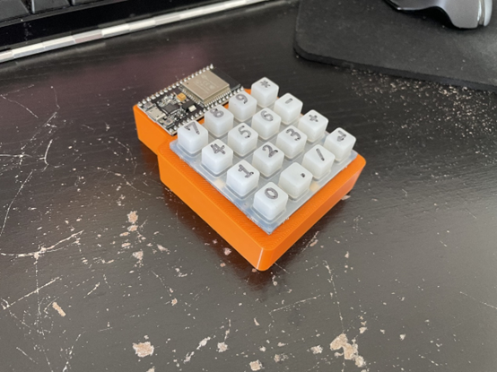
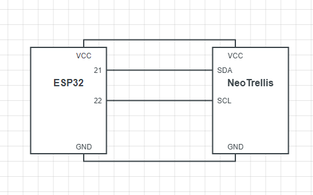
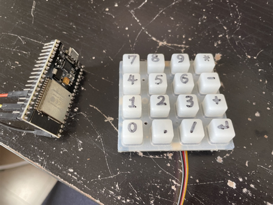
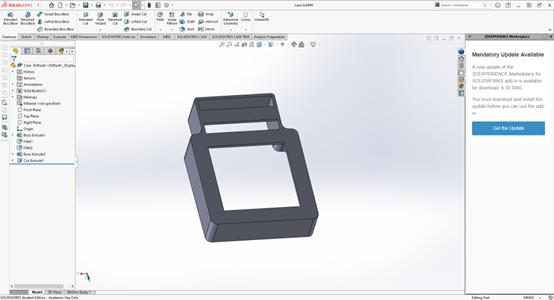

# BLE_Number_Pad
Blue Tooth Number Pad with ESP32

### Motivation: 
I love keyboards to have the number pad on the righthand side (aka 104 keys keypad). But unfortunately, nowadays there are too many keyboards don’t have such feature. So, I want to make one for myself.

### Materials: 
1.	ESP32 WROOM 32; (bought a random one on amazon)
2.	Adafruit NeoTrellis 4x4; (leftover from school project)
3.	3D printed case; (printed in school lab)

### Schematics:

### Development Environment: 
Arduino IDE

### Library Using: 
1.	https://github.com/T-vK/ESP32-BLE-Keyboard
2.	Adafruit_NeoTrellis (installed in Arduino library manager)

### Usage: 
Power on the device, and connect it to your computer (looking for a device called “ESP32 Keyboard”), then press the key accordingly, you can get number input in your device.

You can also customize the keypad by modify the code and the number wrote on the membrane. The key index from top left to bottom right is from 0 to 15 accordingly.  

### Case Design:

### Demo:
